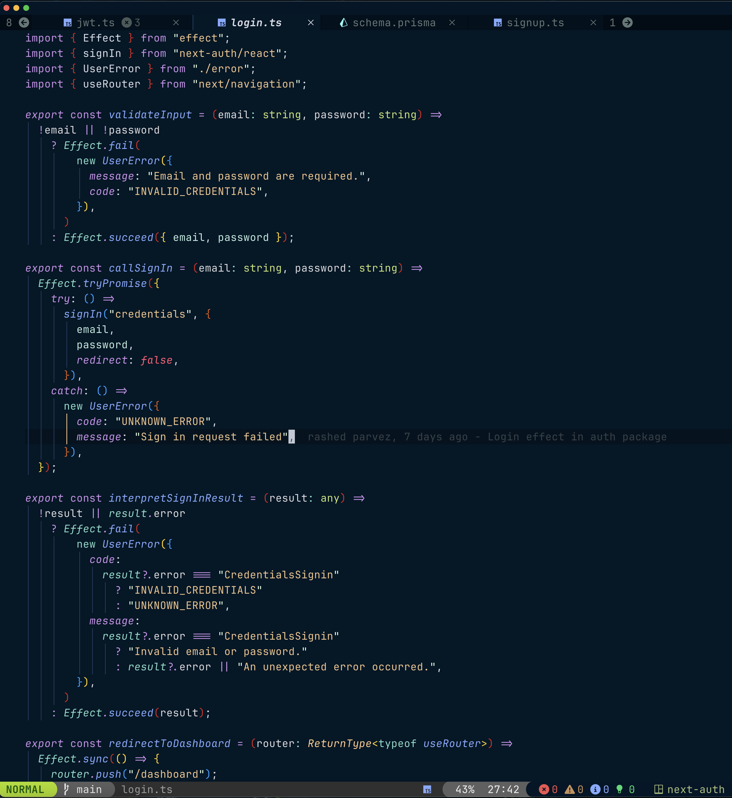
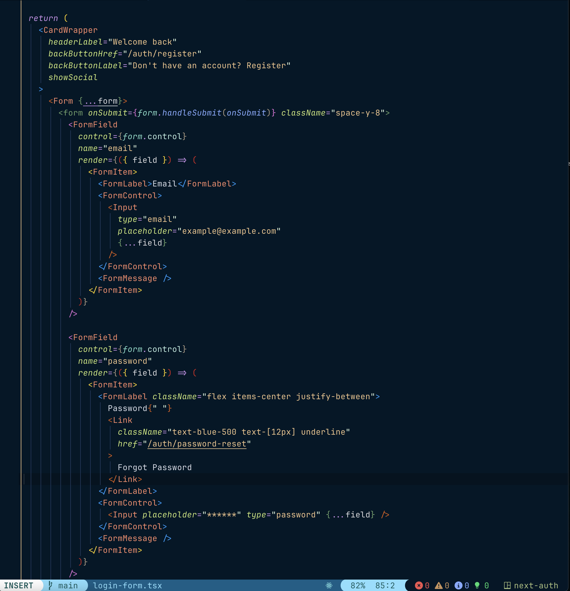
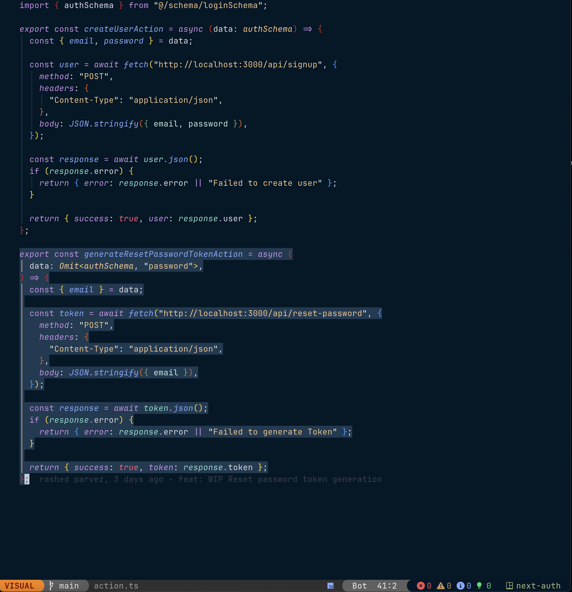
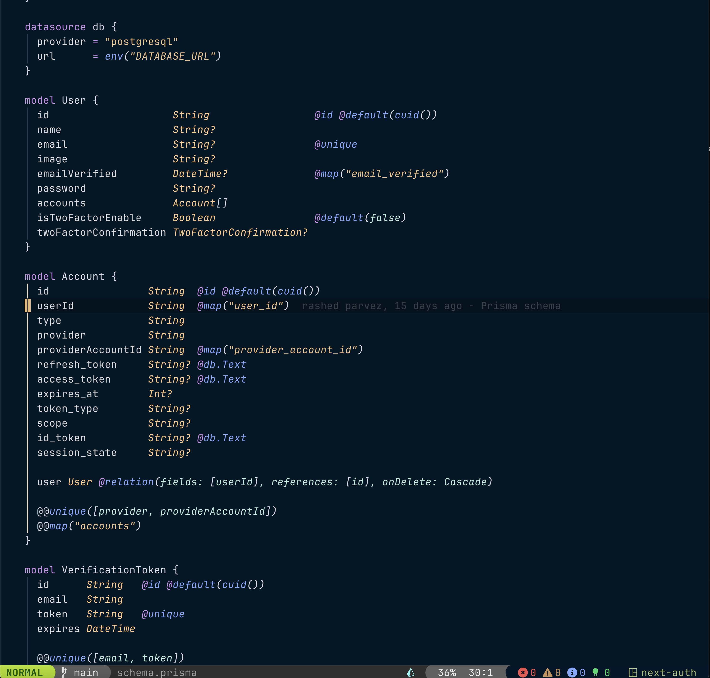
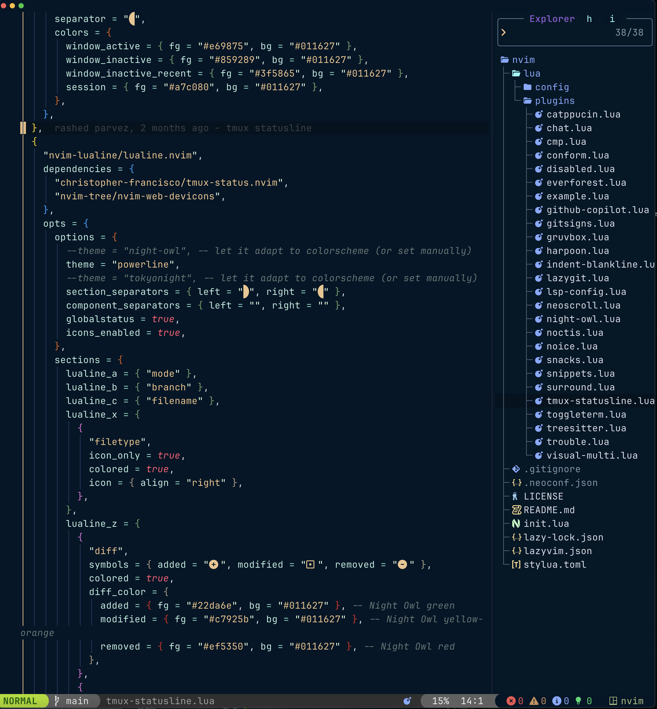

# My Neovim Configuration

This is my personal Neovim configuration, built on top of the excellent [LazyVim](https://github.com/LazyVim/LazyVim) starter.

## 🚀 Installation

1.  **Clone the repository:**
    ```bash
    git clone https://github.com/rashedInt32/lazyvim-config.git ~/.config/nvim
    ```

2.  **Remove the `.git` folder** if you want to use your own version control:
    ```bash
    rm -rf ~/.config/nvim/.git
    ```

3.  **Start Neovim:**
    ```
    nvim
    ```
    LazyVim will automatically install all the plugins.

## ✨ Key Configurations

This configuration includes a number of customizations to the default LazyVim setup.

### Options

*   **Tabs and Indentation:** 2 spaces for tabs, with `expandtab` enabled.
*   **Appearance:** Relative line numbers, `termguicolors`, and the `night-owl` colorscheme.
*   **Behavior:** No swap file, no backup file, and an undo directory is configured. `hlsearch` is disabled, but `incsearch` is enabled.
*   **Go Specific:** For Go files, tabs are set to 4 spaces and `expandtab` is disabled.

### Keymaps

Here are some of the custom keymaps:

| Keymap          | Description                               |
| --------------- | ----------------------------------------- |
| `<leader>pv`    | Open file explorer (`Ex`)                 |
| `v, J`/`K`      | Move selected lines up/down               |
| `<leader>d`     | Safe delete (doesn't change clipboard)    |
| `<leader>c`     | Safe change (doesn't change clipboard)    |
| `<leader>L`     | Open the Lazy package manager             |
| `<leader>td`    | Toggle diagnostics with Trouble           |
| `<C-s>`         | Save the current file                     |
| `<leader>x`     | Make the current file executable          |
| `<leader>gd`    | Go to definition (LSP)                    |
| `<leader>y`     | Yank to system clipboard                  |
| `]c`/`[c`       | Go to next/previous git hunk              |

For a full list of keymaps, see `lua/config/keymaps.lua`.

## 📸 Screenshots

*(Space to add screenshots of the configuration in action)*





